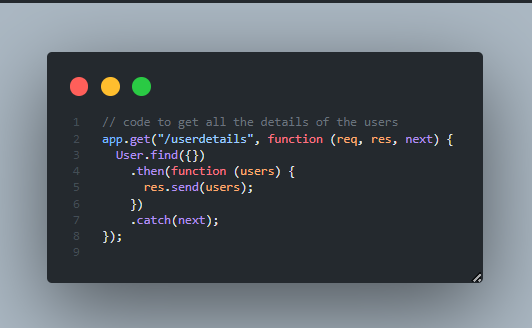

# MERN-crud
This is a simple web application built with the MERN (MongoDB, Express, React, Node.js) stack. 
It provides basic CRUD (Create, Read, Update, Delete) functionality for managing information through a RESTful API 
created with Node.js and MongoDB as the database.

## Features
## Create new records with relevant information. 
 
API(node.js) 
 
Fetching API in React.js 

## Fetch existing records from the database. 
API(node.js) 
 
Fetching API in React.js 

## Update existing records with updated information and Delete records from the database. 
## Homepage for Editing and Deleting Users
 

## Edit User
Edit User API (Node.js)  
 
Frontend For Edit User 
 

## Delete User
Delete User API (Node.js)  
 
Frontend For Deleteing User 
 

## Database
 

## Technologies Used
MongoDB: A NoSQL database for storing data. 
Express: A web application framework for building the API. 
React: A JavaScript library for building user interfaces. 
Node.js: A JavaScript runtime for running server-side code. 
Mongoose: An Object Data Modeling (ODM) library for MongoDB and Node.js. 

## Packages
react-router-dom 
axios 
semantic-ui-react 
react icons 
Cors

## Installation
1. git clone https://github.com/mihika14/MERN-crud-app.git
2. cd client
3. npm i (react-router-dom , axios)
4. npm start
5. cd ../server
6. npm i (mongoose ,mongodb , express , cors)
7. npm run devStart
